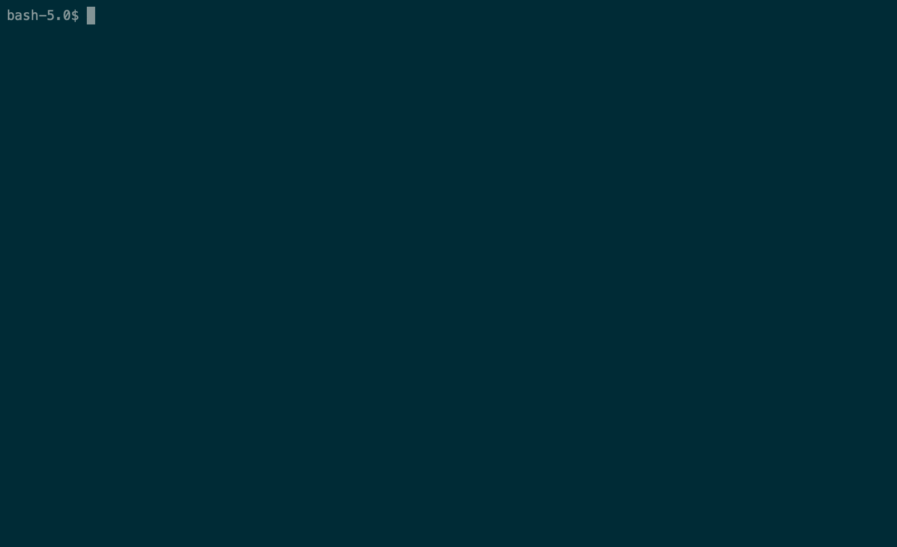

# FairDEx
Practical and Fair Exchange of Exclusive DigitalGoods

This repository contains a research prototype and evaluation dataset of FairDEx protocol proposed in "Practical and Fair Exchange of Exclusive DigitalGoods" submitted to the  Financial Cryptography and Data Security 2020 (FC'20).

## Getting Started

### Prerequisites
1. Client applications require `web3.py` for blockchain interaction. Install it via `pip install web3`.
2. The prototype uses Infura API to connect Ethereum network. Get a free API key at [https://infura.io](https://infura.io).
3. To deploy the contract you can use MetaMask wallet installed in your browser. MetaMask is available at [https://metamask.io/](https://metamask.io).

### Installation
1. Clone git repository
`git clone https://github.com/.../fairdex.git`
2. Deploy FairDEx smart contract on Ropsten network. Go to [remix.ethereum.org](remix.ethereum.org) and open [fairdex.sol](fairdex.sol) in Remix IDE. Next, compile the source and deploy the contract.
3. Edit conf files. Open [sender.conf](sender.conf) and [receiver.conf](receiver.conf) in a text editor and enter required information like Infura URL and contract address.

### Usage
1. Run sender application `python sender.py`.
2. This will produce a file called `offchain.txt`. Make sure that this file is in the same folder with `receiver.py`.
3. Run receiver application `python receiver.py`.
4. Follow the instructions on the terminal.

Sender                                |  Receiver
:------------------------------------:|:----------------------------------------:
  |  
 
### Description of Files
* [fairdex.sol](fairdex.sol): Source code of FairDEx smart contract.
* [evaluation-dataset.ods](evaluation-dataset.ods): Reports the measurement of costs for deploying and running FairDEx. In addition, this file contains the contract addresses used in our experiments.
* [sender.py](sender.py): Client application for sender.
* [receiver.py](receiver.py): Client application for receiver.
* [sender.conf](sender.conf): Configuration file for sender application. Must be filled before running [sender.py](sender.py).
* [receiver.conf](receiver.conf): Configuration file for receiver application. Must be filled before running [receiver.py](receiver.py).
